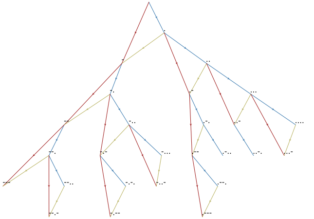
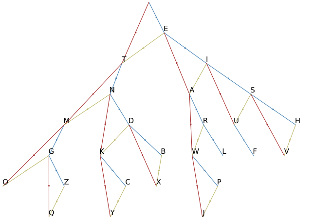
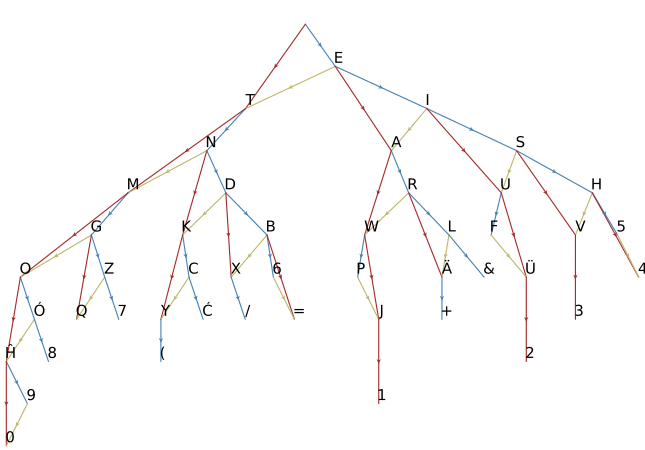

# morse_fibonacci
Visualizing morse code with Fibonacci trees. In the following trees blue edges represent appending a dot, red represents appending a dash, and yellow represents replacing a trailing dot with a dash. If you take just the blue and yellow edges, you get a Fibonacci tree. If you take the blue and red edges you get a binary  tree, but a sort of tiered binary tree where every node has a child one tier down and another two tiers down. I think this would be equally deserving of the name "Fibonacci tree".

Another interesting observation is that we can index the nodes in the `n`th row of the tree with the integers from `0` to `F_{n+1} - 1` using "base Fibonacci", where instead of digits representing multiples of powers of some base, they represent multiples of the fibonacci numbers (with digits being either `0` or `1`, and starting from `F_2 = 1`). We can do this by letting each `.` be a `0` and each `-` be a `01`. This is best explained by an example:
```
--.-. = 01010010 = F_8 + F_6 + F_3
```



